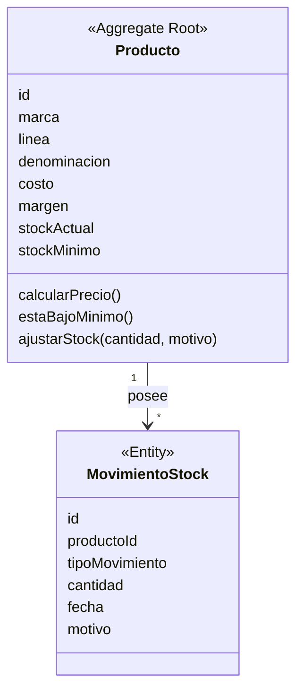

# Sistema de Gestión de Productos e Inventario

## Análisis de Dominio con enfoque Domain-Driven Design (DDD)

**Trabajo Práctico — Ingeniería de Software**

---

## 2. Lenguaje Ubicuo (Ubiquitous Language)

> **Concepto clave:**  
> El lenguaje ubicuo es el vocabulario común que usan negocio y desarrollo para nombrar los mismos conceptos. Su objetivo es que no existan "traducciones" entre lo que dice el cliente y lo que dice el código: si un término cambia en la conversación con el negocio, debe cambiar también en el modelo.
>
> **Ejemplo 1:** si un encargado de depósito dice "este producto está por debajo del mínimo", el método en el código debe llamarse `estaBajoMinimo()`, no un nombre técnico distinto como `checkThreshold()`.
>
> **Ejemplo 2:** la palabra "Margen" debe significar exactamente lo mismo en la reunión con el cliente, en la documentación y en el atributo `margen` del código.

Uno de los pilares de DDD es que todo el equipo —negocio, análisis y desarrollo— use el mismo vocabulario para referirse a los mismos conceptos. A partir del análisis del dominio se identifica el siguiente glosario:

| Término | Significado en el dominio |
|---|---|
| **Producto** | Bien comercializable gestionado por el sistema, identificado por marca, línea y denominación. |
| **Marca** | Fabricante o identificación comercial del producto. |
| **Línea** | Categoría o familia a la que pertenece el producto (ej.: Gaseosas). |
| **Costo** | Valor de adquisición del producto, base para calcular el precio. |
| **Margen** | Porcentaje de ganancia aplicado sobre el costo para obtener el precio de venta. |
| **Precio** | Valor de venta al público. Se deriva de Costo + Margen. |
| **Stock actual** | Cantidad disponible del producto en un momento dado. |
| **Stock mínimo** | Umbral definido para el producto; por debajo de él se considera stock bajo. |
| **Movimiento de stock** | Registro de un cambio en el stock (compra, venta, devolución o ajuste). |
| **Ajuste de stock** | Modificación manual del stock, siempre con un motivo (rotura, pérdida, error de carga, inventario físico, etc.). |
| **Alerta / Stock bajo** | Estado de un producto cuando su stock actual es menor o igual al stock mínimo. |
| **Lista de precios** | Reporte de solo lectura con productos agrupados por línea junto a su precio. |

> **Nota:** los conceptos clave del documento original fueron generados mediante Claude (Anthropic).

---

## 3. Bounded Contexts

> **Concepto clave:**  
> Un *Bounded Context* es un límite conceptual dentro del cual un modelo y su lenguaje son válidos y consistentes. Fuera de ese límite, la misma palabra puede significar otra cosa. Delimitar contextos evita que un solo modelo gigante intente representar todo el negocio, lo cual lo vuelve inmanejable.
>
> **Ejemplo 1:** "Producto" dentro del contexto Catálogo es marca + línea + denominación; dentro del contexto Comercial, ese mismo "Producto" se ve como un ítem de una venta, con cantidad y subtotal. Son dos vistas distintas de la misma palabra.
>
> **Ejemplo 2:** separar Inventario de Comercial permite que cada equipo evolucione su modelo —y hasta su base de datos— sin romper al otro contexto.

Del análisis del negocio se pueden identificar tres posibles contextos delimitados:

| Contexto | Responsabilidad | Alcance en este trabajo |
|---|---|---|
| **Catálogo** | Producto, Marca, Línea (datos maestros) | Incluido (compartido con Inventario) |
| **Inventario (CORE)** | Stock, Movimientos de stock, Alertas | Foco principal del trabajo |
| **Comercial (opcional)** | Ventas, Compras | Fuera de alcance / evolución futura |

El trabajo se enfoca en el contexto de **Inventario**, que es el núcleo (*core domain*) del sistema, integrando allí también la gestión de datos de producto (Catálogo), dado que en este alcance ambos conceptos están fuertemente acoplados.

---

## 4. Modelo de Dominio Propuesto

> **Concepto clave:**  
> El modelo de dominio es la representación en entidades, *Value Objects* y relaciones que expresa las reglas del negocio dentro del código, dejando afuera detalles técnicos como base de datos o framework web.
>
> **Ejemplo 1:** en este trabajo el modelo de dominio está compuesto por el agregado `Producto` y la entidad `MovimientoStock`, detallados a continuación.

Se identifican dos agregados principales y dos *Value Objects* candidatos.

### 4.1 Producto (Aggregate Root)

> **Concepto clave:**  
> Un *Aggregate Root* es la entidad principal de un agregado: es la única puerta de entrada para modificar el estado de todo el conjunto, y su responsabilidad es garantizar que las reglas del agregado se cumplan siempre.
>
> **Ejemplo 1:** para ajustar el stock no se modifica directamente un campo desde afuera; se llama a `producto.ajustarStock(cantidad, motivo)`, así la regla "todo ajuste necesita motivo" se cumple siempre, sin excepción.
>
> **Ejemplo 2:** en un e-commerce, un `Pedido` (`Order`) es *Aggregate Root* de sus líneas de pedido (`OrderLines`): no se edita una línea directamente, se pasa siempre por el pedido.

Representa el producto dentro del sistema. Es una entidad con identidad propia (`id`) y ciclo de vida, y no un simple registro de datos: el precio y el stock forman parte de su estado, y expone comportamiento propio —calcular su precio, verificar si está en stock bajo y ajustar su stock—.

**Atributos:**

- `id`
- `marca`
- `linea`
- `denominacion`
- `costo`
- `margen`
- `stockActual`
- `stockMinimo`

**Comportamiento (métodos de dominio):**

```text
calcularPrecio()
estaBajoMinimo(): boolean
ajustarStock(cantidad, motivo)
```

**Ejemplo:**

```text
Marca: Coca-Cola
Línea: Gaseosas
Denominación: Coca-Cola 2L

Costo: $1000
Margen: 15%
Precio calculado: $1150

Stock actual: 20
Stock mínimo: 5
Estado: no está en alerta
```

### 4.2 MovimientoStock (Entity)

> **Concepto clave:**  
> Una *Entity* es un objeto con identidad propia (`id`) que persiste en el tiempo; dos entidades son distintas aunque tengan los mismos atributos, porque lo que importa es "cuál" es, no solo sus valores.
>
> **Ejemplo 1:** dos ajustes de "-2 unidades" hechos el mismo día son dos `MovimientoStock` distintos, cada uno con su propio `id`, aunque los datos se vean iguales.
>
> **Ejemplo 2:** `MovimientoStock` es *Entity* —y no *Value Object*— precisamente porque a fines de auditoría importa poder identificar cada movimiento de forma individual.

Representa cada cambio producido sobre el stock de un producto. Es la entidad que aporta trazabilidad e historial: sin ella solo sabríamos "cuánto stock hay", pero no "por qué" llegó a ese valor.

**Atributos:**

- `id`
- `productoId`
- `tipoMovimiento`
- `cantidad`
- `fecha`
- `motivo`

**Tipos de movimiento:**

- Compra (aumenta stock).
- Venta (disminuye stock).
- Devolución de cliente.
- Devolución a proveedor.
- Ajuste (motivo libre: error de carga, rotura, pérdida, inventario físico).

**Ejemplo de ajuste:**

```text
Stock actual: 10
Ajuste: -2
Motivo: rotura
Nuevo stock: 8
```

### 4.3 Value Objects candidatos

> **Concepto clave:**  
> Un *Value Object* (VO) es un objeto sin identidad propia, definido únicamente por sus atributos: dos VOs con los mismos valores se consideran iguales y, por lo general, son inmutables.
>
> **Ejemplo 1:** un `Margen` de `15%` es igual a cualquier otro `Margen` de `15%`: no importa "cuál" es, solo su valor.
>
> **Ejemplo 2:** otros VOs típicos fuera de este trabajo son una dirección postal, un rango de fechas o un importe de dinero con su moneda.

- **Precio:** encapsula el valor calculado y podría incluir moneda o reglas de redondeo.
- **Margen:** encapsula el porcentaje aplicado; permite que cada producto tenga un margen propio sin duplicar lógica.

Modelar `Margen` y `Precio` como *Value Objects* —en vez de campos sueltos— es una decisión de diseño abierta a debate: simplifica el modelo inicial mantenerlos como atributos primitivos, pero a medida que el sistema crece —por ejemplo, si se necesitan distintas monedas o reglas de redondeo— conviene encapsularlos.

### 4.4 Diagrama de agregados



Un `Producto` puede tener muchos `MovimientoStock` asociados —relación 1 a N—; cada movimiento pertenece a un único producto y referencia su `id`.

---

## 5. Reglas de Negocio

> **Concepto clave:**  
> Las reglas de negocio son las restricciones y cálculos que reflejan cómo funciona realmente el negocio. En DDD deben vivir dentro del dominio —entidades o servicios de dominio— y no en la interfaz de usuario ni en la base de datos, para que exista una única fuente de verdad.
>
> **Ejemplo 1:** si la regla "Precio = Costo + Margen" estuviera solo en el frontend, cualquier otro cliente —una app móvil o un proceso batch— podría calcular mal el precio. Al vivir en `Producto`, todos comparten la misma regla.

### 5.1 Regla de cálculo de precio

**Precio = Costo + Margen**

El margen general es del **15%**, pero algunos productos pueden definir un margen especial. Por eso la regla vive en la entidad `Producto` —no en un controller ni en la capa de presentación—: es `Producto` quien conoce su propio costo y margen.

| Caso | Costo | Margen | Precio final |
|---|---:|---:|---:|
| Estándar | $1000 | 15% | $1150 |
| Margen especial | $1000 | 25% | $1250 |

### 5.2 Regla de stock bajo

```text
Si stockActual <= stockMinimo
→ el producto entra en estado de alerta
```

**Ejemplo:** stock actual = 5, stock mínimo = 5 → el producto queda en alerta (`Producto Coca-Cola 2L con stock bajo`).

Esta regla también vive en `Producto`, a través del método `estaBajoMinimo()`. Es importante separar la **detección del problema** —que hace el dominio— de la **reacción ante el problema** —notificar, listar, avisar—, que corresponde a la capa de aplicación.

### 5.3 Ajuste de stock

Permite modificar manualmente el stock de un producto, siempre indicando un motivo.

Motivos típicos:

- Error de carga.
- Rotura.
- Pérdida.
- Inventario físico.

Puede resultar en un aumento o una disminución de stock, y queda registrado como un `MovimientoStock` para mantener trazabilidad.

### 5.4 Otras reglas importantes

- El stock no puede ser negativo.
- El precio siempre debe derivar de costo + margen; no se carga un precio arbitrario.
- Todo ajuste de stock debe registrar un motivo obligatorio.
- Movimientos y stock actual deben mantenerse consistentes entre sí.

---

## 6. Comportamientos del Dominio

> **Concepto clave:**  
> En DDD se busca un "modelo rico": entidades con comportamiento propio, en contraposición al "modelo anémico", donde las clases solo tienen atributos con getters/setters y toda la lógica vive afuera —en servicios o controllers—.
>
> **Ejemplo 1:** en un modelo anémico, un servicio externo lee `producto.stock`, `producto.stockMinimo` y compara "a mano" en cada lugar donde se necesita. En un modelo rico, `producto.estaBajoMinimo()` encapsula esa comparación una sola vez dentro del dominio.

El sistema no es solo un conjunto de datos: modela acciones del negocio. El dominio debe permitir:

- Registrar compras —aumenta stock—.
- Registrar ventas —disminuye stock—.
- Registrar devoluciones —de cliente o a proveedor—.
- Realizar ajustes de stock con motivo.
- Calcular el precio de un producto.
- Verificar si un producto está en stock bajo.

Toda esta lógica se ubica dentro del dominio —entidades y, si se justifica, servicios de dominio—, nunca en controllers ni en la capa de infraestructura.

---

## 7. Eventos de Dominio

> **Concepto clave:**  
> Un *Domain Event* representa algo que ya ocurrió en el dominio y que puede resultar relevante para otras partes del sistema. Permite desacoplar: quien genera el evento no necesita saber quién lo va a escuchar ni qué va a hacer con él.
>
> **Ejemplo 1:** el evento `StockBajo` puede disparar, según el sistema que lo escuche, un email al encargado de compras, una notificación push o simplemente un registro en un reporte, sin que `Producto` conozca ninguno de esos detalles.
>
> **Ejemplo 2:** en un sistema de e-commerce, un evento típico sería `PedidoConfirmado`, que dispara en paralelo el envío de un mail, la actualización de un stock y la generación de una factura.

Se identifican dos eventos de dominio principales:

- **`StockBajo`**: se dispara cuando, tras un movimiento, un producto queda con `stockActual <= stockMinimo`.
- **`StockActualizado`**: se dispara cada vez que cambia el stock de un producto, por cualquier tipo de movimiento.

Estos eventos permiten desacoplar la detección de un problema de la reacción ante él: habilitan notificaciones, integraciones con otros sistemas y auditoría, sin que la entidad `Producto` necesite conocer quién reacciona ni cómo.

---

## 8. Listas de Precios (modelo de lectura)

> **Concepto clave:**  
> CQRS (*Command Query Responsibility Segregation*) es un patrón que separa el modelo de escritura —comandos que cambian el estado, con todas sus reglas y validaciones— del modelo de lectura —consultas optimizadas para mostrar información rápidamente, sin pasar por las reglas de negocio de escritura—.
>
> **Ejemplo 1:** una lista de precios no necesita pasar por `producto.calcularPrecio()` cada vez que se muestra: puede leerse directamente de una tabla o consulta ya optimizada para listar. Es lectura pura, no un comando.
>
> **Ejemplo 2:** otro ejemplo típico de modelo de lectura sería un reporte "Productos con stock bajo", pensado solo para mostrarse rápidamente en una pantalla o exportarse.

Una lista de precios es un agrupamiento de productos con su precio, organizado por línea. A diferencia de `Producto` y `MovimientoStock`, no representa necesariamente una entidad persistente: es un modelo de lectura (*query*), separado del modelo de escritura.

**Ejemplo — Línea: Gaseosas**

```text
Coca-Cola 2L → $1500
Sprite 2L    → $1400
```

Esta separación entre modelo de escritura —agregados `Producto` / `MovimientoStock`— y modelo de lectura —listas de precios, reportes de stock bajo— es un buen punto de entrada para introducir el patrón CQRS como posible evolución del sistema.

---

## 9. Decisiones de Diseño

> **Concepto clave:**  
> Modelar con DDD implica tomar decisiones de *trade-off* —rendimiento vs. pureza del modelo, simplicidad vs. escalabilidad— y documentarlas, para que quede claro por qué el sistema quedó diseñado de una forma y no de otra.
>
> **Ejemplo 1:** guardar `stockActual` como campo —rápido de leer— y además registrar cada `MovimientoStock` —para no perder el historial— es un trade-off típico entre rendimiento y trazabilidad.

| Decisión | Opción elegida | Justificación |
|---|---|---|
| ¿Se guarda o se calcula el stock? | Se guarda `stockActual` y además se registran los movimientos. | Guardar el valor da rendimiento en las consultas; registrar los movimientos da historial y trazabilidad. Se usan ambos. |
| ¿Dónde vive la regla de precio? | Método `calcularPrecio()` en la entidad `Producto`. | El precio depende de datos propios del producto —costo y margen—; la regla debe vivir donde vive el conocimiento. |
| ¿Dónde vive la regla de stock bajo? | Método `estaBajoMinimo()` en `Producto` + evento `StockBajo`. | `Producto` detecta el problema; el evento permite que otras partes del sistema reaccionen sin acoplarse al dominio. |
| ¿Cómo se garantiza la trazabilidad? | Entidad `MovimientoStock` por cada cambio de stock. | Permite auditoría completa: qué cambió, cuándo y por qué motivo. |
| ¿Dónde va la lógica de negocio? | Dentro del dominio —entidades / servicios de dominio—. | Nunca en controllers: evita duplicar reglas y mantiene el dominio como fuente única de verdad. |

### 9.1 Guía general de ubicación de reglas

Una pregunta útil para decidir dónde ubicar cada regla es:

> **¿Quién conoce esta regla en el negocio?**

| Regla | Ubicación |
|---|---|
| Calcular precio | `Producto` (entidad) |
| Detectar stock bajo | `Producto` (entidad) |
| Generar alerta / notificar | Evento de dominio |
| Guardar datos | Infraestructura (fuera del dominio) |

---

## 10. Conclusión

Este sistema no trata simplemente de guardar datos en una base de datos: se trata de modelar el comportamiento del negocio.

El análisis realizado permite pasar de una visión centrada en el dato a una visión centrada en el comportamiento, y de un simple estado a reglas de negocio explícitas y ubicadas correctamente dentro del dominio. Ese es precisamente el aporte central de Domain-Driven Design.

### 10.1 Posibles evoluciones

- Separar Inventario como *Bounded Context* independiente de Catálogo.
- Aplicar CQRS de forma más estricta —modelos de lectura separados para listas de precios y reportes de stock—.
- Incorporar validaciones más fuertes —por ejemplo, no permitir vender sin stock disponible—.
- Modelar `Precio` y `Margen` como *Value Objects* explícitos.
- Incorporar el contexto Comercial —Ventas, Compras— como colaborador del contexto Inventario.

### 10.2 Conceptos DDD trabajados en este análisis

- Lenguaje ubicuo.
- *Bounded Contexts*.
- Entidades con comportamiento —no solo datos—.
- *Value Objects*.
- Agregados y su raíz (*Aggregate Root*).
- Reglas de negocio ubicadas dentro del dominio.
- Eventos de dominio.
- Separación entre modelo de lectura y de escritura —CQRS—.
